# Azure Environment Setup Guide

This document walks through the complete setup process of the Azure-based honeypot environment, from provisioning the Windows VM to configuring log ingestion pipelines. Each section corresponds to a key stage in the infrastructure build-out.

> **Note:** This project initially began as an Azure Sentinel dashboard exercise but later evolved into an open-source threat intelligence dataset hosted on GitHub. These setup steps are preserved because they illustrate how the data collection pipeline was originally constructed.

---

## 1. Creating the Honeypot VM

A Windows-based Azure Virtual Machine was provisioned and intentionally exposed to the public internet. The sole purpose of this machine is to attract and log RDP brute-force attempts from around the world.

### 1.1 General Settings Overview

The VM was configured with minimal resources (free-tier eligible) since it only needs to run a lightweight PowerShell script. The key decision here was selecting a **public IP** with no access restrictions on port 3389.

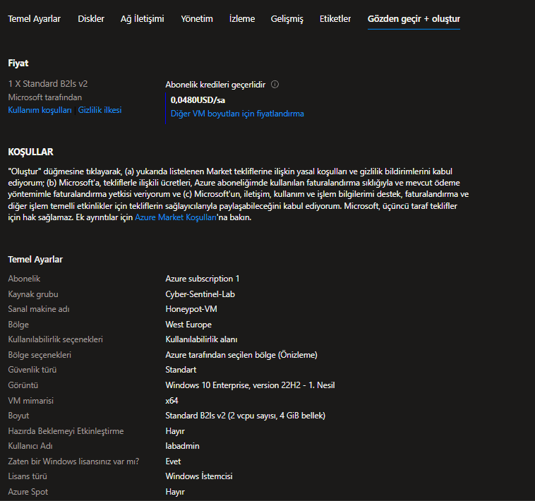

### 1.2 Network and NIC Configuration

The Network Security Group (NSG) was configured to allow **all inbound traffic**, effectively removing any firewall protection at the Azure level. This is critical for a honeypot — the machine must appear vulnerable to attract attackers.

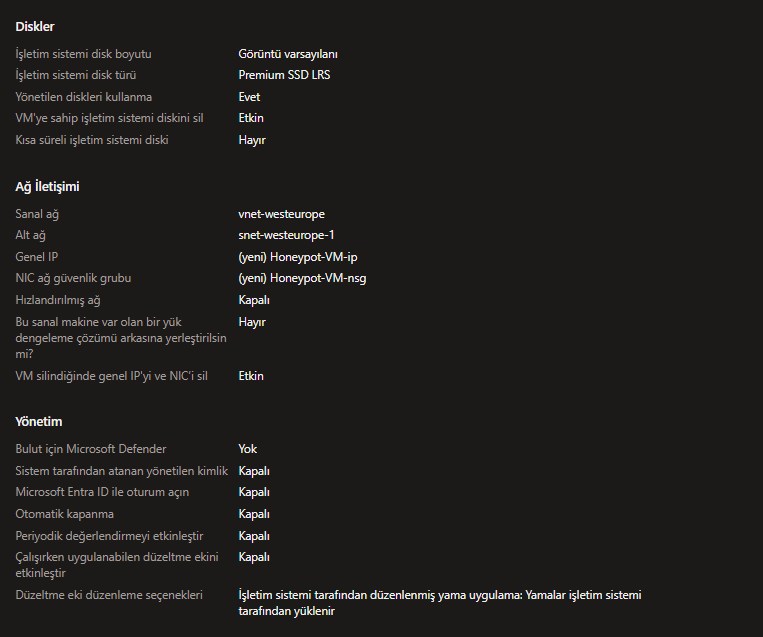

### 1.3 Monitoring and Advanced Settings

Basic monitoring was enabled to track VM health. No additional extensions were installed at this stage.

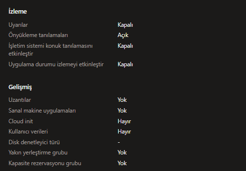

---

## 2. Creating the Log Analytics Workspace

A Log Analytics workspace was provisioned as the central log storage and query engine. This workspace acts as the bridge between the raw security events on the VM and the analytics layer (Sentinel).

### 2.1 Empty State

This screenshot shows the initial state before any workspace is created.

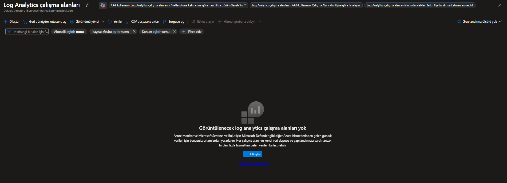

### 2.2 Workspace Creation Form

The workspace was created in the same region as the VM to minimize latency and egress costs.

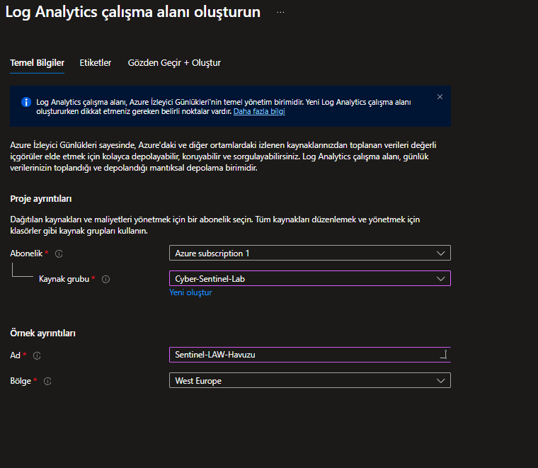

### 2.3 Review and Create

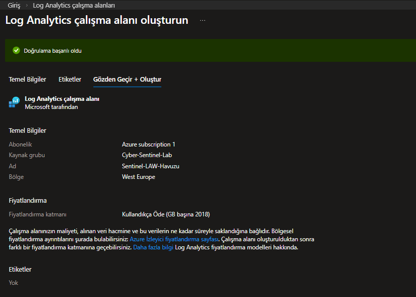

---

## 3. Enabling Microsoft Sentinel

Once the workspace was ready, Microsoft Sentinel was attached to it. Sentinel provides the SIEM (Security Information and Event Management) layer, enabling security event visualization, alerting, and KQL-based querying.

### 3.1 Sentinel Empty State

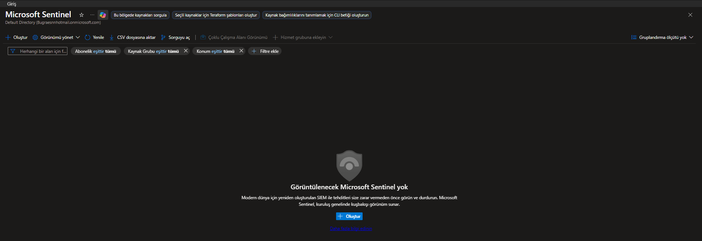

### 3.2 Sentinel Overview Dashboard

After activation, the Sentinel overview dashboard shows a summary of ingested events, active incidents, and data connector health.

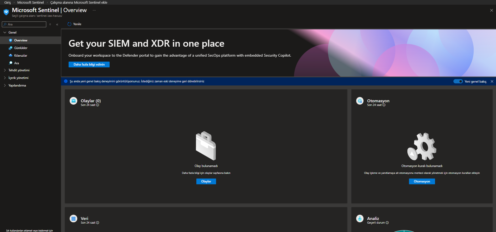

---

## 4. Creating a DCR for Windows Security Events

A Data Collection Rule (DCR) was defined using the Azure Monitor Agent (AMA) to collect specific Windows Security Events — most importantly **Event ID 4625** (Failed Logon Attempts). This is the core event that captures every failed RDP brute-force attempt.

### 4.1 DCR Basic Settings

The DCR was given a descriptive name and linked to the same resource group as the VM and workspace.

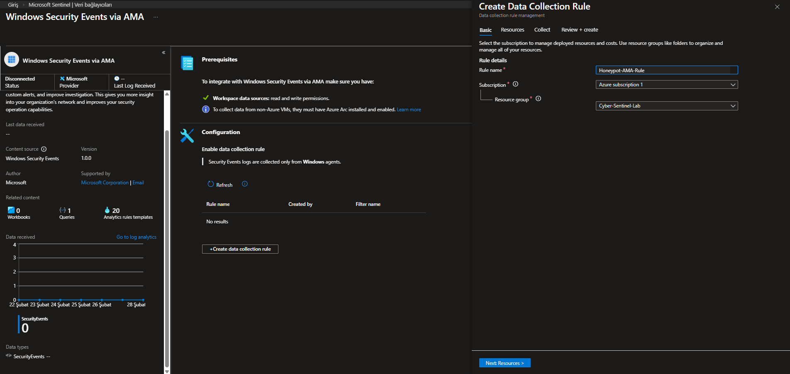

### 4.2 Selecting the Target VM

The honeypot VM was selected as the data source for this collection rule.

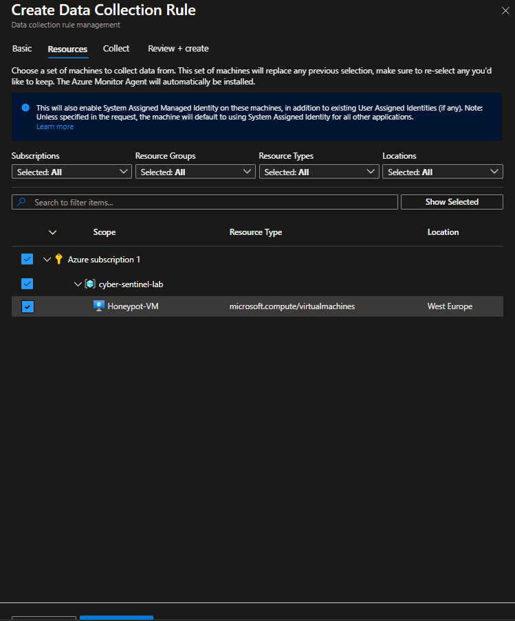

### 4.3 Review and Create

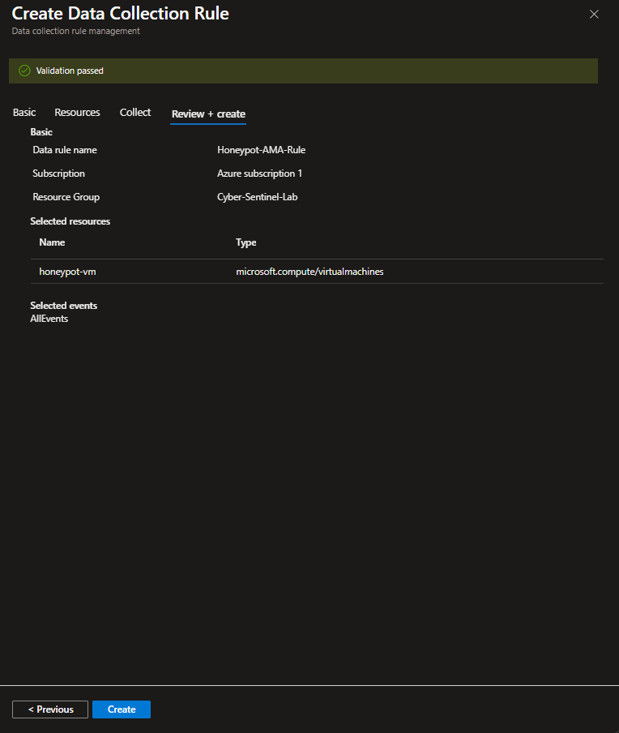

---

## 5. Weakening the Honeypot (Disabling Defenses)

Since this is a honeypot, the goal is to **maximize exposure** rather than harden the system. The Windows Firewall was completely disabled on the VM to ensure that the machine is fully visible and reachable from the internet.

> ⚠️ **Warning:** This configuration is **only appropriate for controlled lab environments**. Never disable the firewall on production systems.

### 5.1 Disabling Windows Firewall

All firewall profiles (Domain, Private, Public) were turned off via the Windows Firewall settings panel.

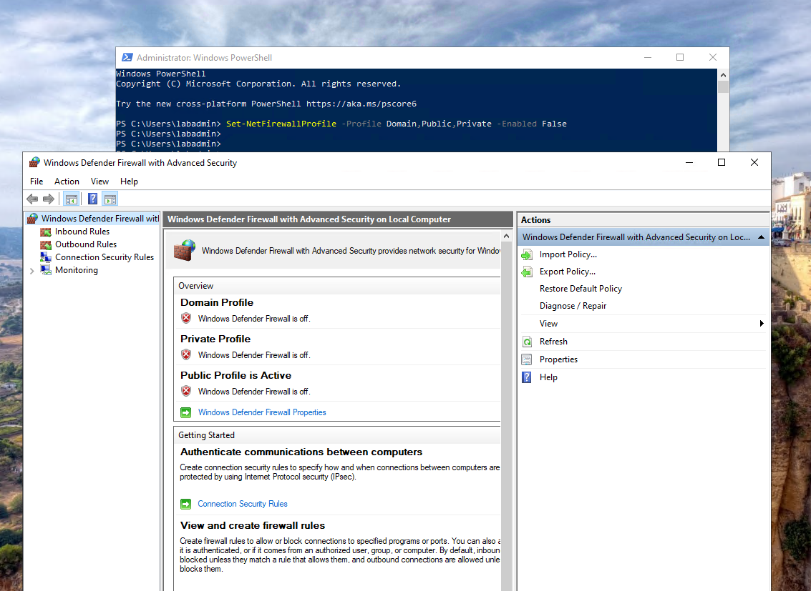

### 5.2 Verifying Public IP Reachability

A simple ping test from an external machine confirmed that the VM's public IP was reachable, validating that the firewall was successfully disabled.

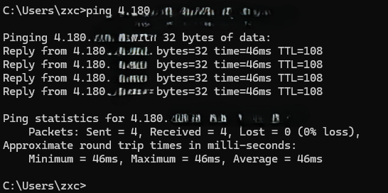

---

## 6. Designing the Custom Log Pipeline

The PowerShell script (`Honeypot_Logger.ps1`) generates a custom log file called `failed_rdp.log` in the `ProgramData` directory. To make this data queryable in Azure, a **Custom Text Log** data source was added to the DCR, pointing to the file path on the VM.

This pipeline enables the geolocation-enriched attack data (collected by the script via the ipgeolocation.io API) to flow into Log Analytics alongside the native Windows Security Events.

### 6.1 Custom Log Review and Create

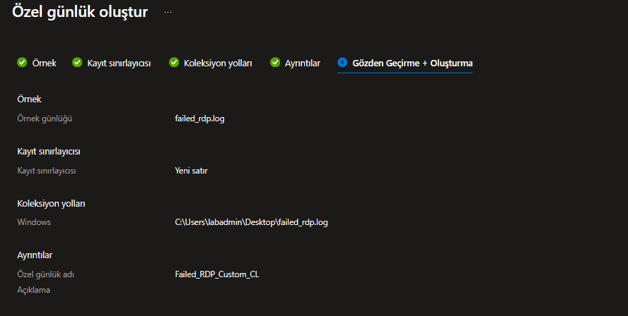

### 6.2 DCR Associated Resources (Initial State)

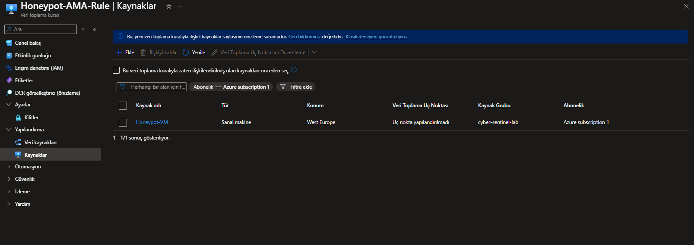

### 6.3 Log File Location on the VM

The script writes to `C:\ProgramData\failed_rdp_dataset.log`. This path was configured as the source file for the custom text log ingestion.

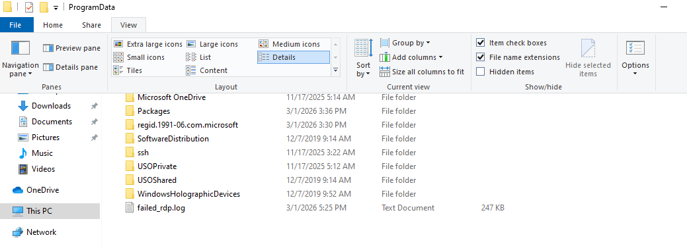

### 6.4 Adding the Custom Text Log Source

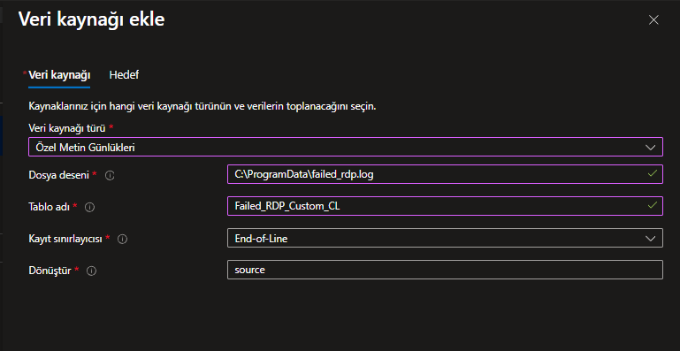

### 6.5 Selecting the Destination Workspace

The custom log was pointed to the same Log Analytics workspace used by Sentinel.

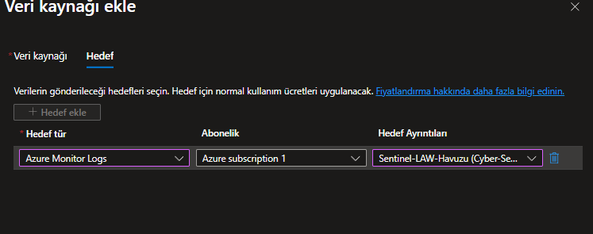

### 6.6 Adding the Data Source to the DCR

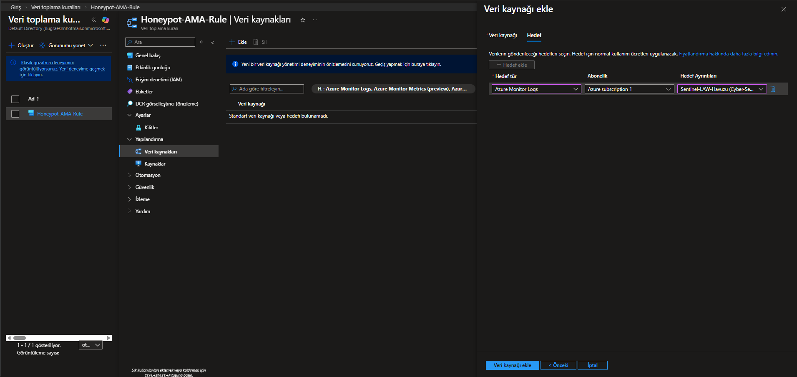

### 6.7 Confirming DCR Resource Associations

After configuration, the DCR shows both the VM and the custom log source as associated resources.

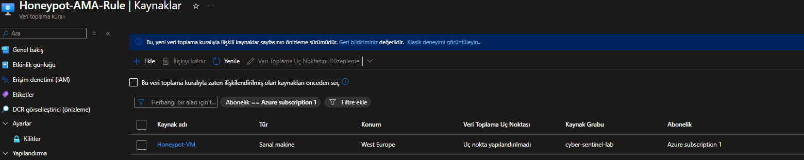

---

## 7. Validating the Data Flow

After the entire pipeline was configured, both the Azure-side ingestion and the VM-side script output were verified.

### 7.1 Querying Event ID 4625 in Sentinel

A KQL query in Sentinel confirmed that failed RDP logon events (Event ID 4625) were being ingested correctly from the honeypot VM.

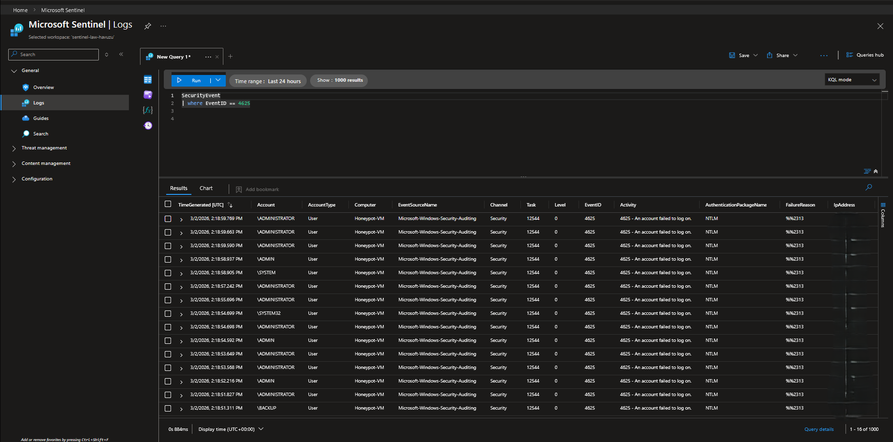

### 7.2 PowerShell Logger Live Output

The PowerShell script running on the VM shows real-time output as it detects new failed login attempts, queries the geolocation API, and logs the enriched data.

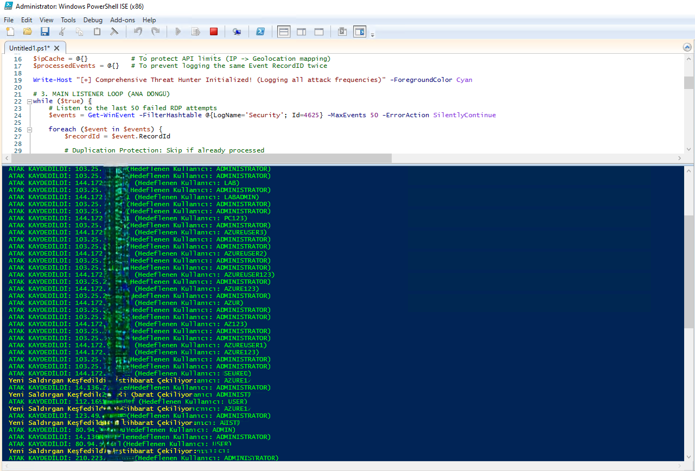

---

## 8. Current Project Direction

Rather than building a traditional SIEM dashboard on Azure Sentinel, the project pivoted to focus on producing the following outputs:

- 📊 **Raw threat data** from failed RDP login attempts
- 🌍 **Geolocation-enriched logs** using IP-based API lookups
- 🔁 **Deduplicated dataset** that preserves attack frequency without duplicate entries
- 🌐 **Open-source cybersecurity dataset** published on GitHub for the community

> This architecture was designed as a lightweight, portable threat intelligence collector. It achieves the same data enrichment as heavy SIEM solutions like Azure Sentinel, but with nothing more than PowerShell and native Windows tools.
